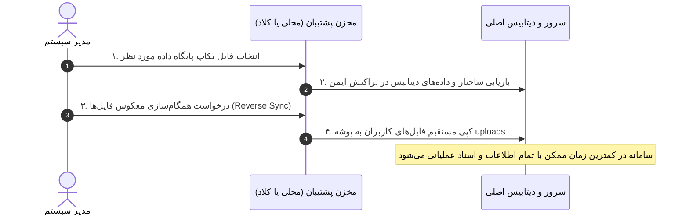

# 📋 پروپوزال جامع استراتژی پشتیبان‌گیری و بازیابی داده‌ها و فایل‌ها
> **سامانه اتوماسیون اداری اروم شیشه ساچی**  
> **نسخه سند:** ۱.۰ | **وضعیت:** پیشنهادی (Proposal)

---

## ۱. مقدمه و چکیده طرح

هدف از این طرح، بازطراحی و استقرار یک معماری استاندارد، پایدار و دوگانه برای حفاظت از داده‌های حیاتی سامانه اتوماسیون اداری است. در این معماری، **دو مفهوم و رویکرد کاملاً متمایز** برای ذخیره‌سازی داده‌های پایگاه داده و فایل‌های آپلود شده کاربران در نظر گرفته شده است:

1. **پایگاه‌داده (Database):** استراتژی پشتیبان‌گیری مبتنی بر عکس‌برداری (Snapshot/Dump) دوره‌ای و دستی همراه با فشرده‌سازی استریم، اعتبارسنجی صحت داده و مدیریت چرخه عمر (Retention Policy).
2. **فایل‌های کاربران (User Uploads):** استراتژی **همگام‌سازی افزایشی فقط-الحاقی (Additive / Append-Only Mirror Sync)** با مقاصد دوگانه (محلی و کلاد)، به‌گونه‌ای که فایل‌ها در ساختار مستقیم و بدون فشرده‌سازی آرشیوی نگهداری شده و فایل‌های حذف‌شده در مبدا، هرگز از مقاصد بکاپ حذف نمی‌شوند.

---

## ۲. دیاگرام کلان معماری (High-Level Architecture)

```mermaid
flowchart TB
    subgraph SourceSystem [سیستم اصلی / سرور عملیاتی]
        LiveDB[(پایگاه‌داده PostgreSQL)]
        UploadsDir[📁 پوشه uploads\nفایل‌ها و اسناد کاربران]
    end

    subgraph AutomationEngine [موتور پردازش و مدیریت پشتیبان‌گیری]
        DBEngine[موتور پایگاه‌داده\n- پشتیبان‌گیری دستی آنی\n- زمان‌بندی خودکار Cron\n- فشرده‌سازی استریم Gzip]
        SyncEngine[موتور میرورینگ افزایشی\n- همگام‌سازی فقط-الحاقی\n- مقایسه متادیتا و هش\n- سیاست عدم حذف No-Delete]
    end

    subgraph DualTargets [مقاصد دوگانه ذخیره‌سازی]
        subgraph LocalDestination [۱. مقصد محلی (Local Mirror)]
            LocalDBRepo[(مخزن نسخه‌های DB\nدارای سیاست Retention)]
            LocalFileMirror[📁 درخت پوشه‌ها و فایل‌ها\n(دسترسی مستقیم و تفکیک‌شده)]
        end

        subgraph CloudDestination [۲. مقصد ابری / ریموت (Cloud Mirror)]
            CloudDBRepo[(فضای ابری DB\nآرشیو امن خارج از سایت)]
            CloudBucket[☁️ فضای ذخیره‌سازی ابری / S3 / MinIO\n(همگام و افزایشی)]
        end
    end

    LiveDB --> DBEngine
    UploadsDir --> SyncEngine

    DBEngine --> LocalDBRepo
    DBEngine --> CloudDBRepo

    SyncEngine -->|انتقال فایل‌های جدید و ویرایش‌شده| LocalFileMirror
    SyncEngine -->|انتقال فایل‌های جدید و ویرایش‌شده| CloudBucket
```

---

## ۳. بخش اول: استراتژی فایل‌های کاربران (همگام‌سازی افزایشی فقط-الحاقی)

### ۳.۱. تبیین مفهوم Additive / Append-Only Mirroring
در روش‌های سنتی، فایل‌ها به صورت پکیج‌های فشرده (`.zip`) روزانه ذخیره می‌شوند که مشکلاتی از جمله زمان‌بر بودن اکسترکت، نیاز به فضای چندبرابری دیسک و پیچیدگی زنجیره بازیابی ایجاد می‌کنند.  
در این طرح، فایل‌های کاربران به صورت **میرور درختی زنده (Directory Tree Mirror)** همگام‌سازی می‌شوند:
* **فایل جدید:** بلافاصله به مقصد محلی و ابری کپی می‌شود.
* **فایل تغییریافته:** در مقصدها با نسخه جدید جایگزین (یا نگهداری نسخه قبلی) می‌شود.
* **فایل حذف‌شده در سامانه:** **هرگز از مقاصد بکاپ حذف نمی‌شود (No-Delete Policy).**

```mermaid
flowchart TD
    Start([شروع فرآیند همگام‌سازی فایل‌ها]) --> Scan[پویش فایل‌های پوشه uploads]
    Scan --> FileLoop{بررسی هر فایل}
    
    FileLoop --> ExistsCheck{آیا فایل در مقصد وجود دارد؟}
    
    ExistsCheck -- خیر --> CopyNew[کپی فایل جدید به مقصد محلی و کلاد]
    ExistsCheck -- بله --> HashCheck{آیا اندازه یا تاریخ تغییر کرده؟}
    
    HashCheck -- بله --> UpdateFile[به‌روزرسانی فایل در مقاصد]
    HashCheck -- خیر --> Skip[رد شدن بدون مصرف پهنای باند و دیسک]
    
    CopyNew --> NextFile[فایل بعدی]
    UpdateFile --> NextFile
    Skip --> NextFile
    
    NextFile --> DeletedCheck[بررسی فایل‌های حذف‌شده در مبدا]
    DeletedCheck --> Preserve[⛔ حفظ قطعی فایل‌ها در مقصدها\n(جلوگیری از حذف تصادفی یا باج‌افزار)]
    Preserve --> End([پایان فرآیند همگام‌سازی])
```

### ۳.۲. مزایای کلیدی میرورینگ فایلی:
1. **دسترسی بدون واسطه (Instant Direct Access):** در صورت نیاز به یک سند خاص، نیازی به باز کردن یا استخراج فایل‌های فشرده حجیم نیست؛ مدیر سیستم مستقیماً فایل مورد نظر را از ساختار فولدر مقصد برمی‌دارد.
2. **حفاظت کامل در برابر باج‌افزار و خطای انسانی (Ransomware & Human Error Shield):** اگر فایلی توسط کاربر به اشتباه پاک شود یا رکوردی از بین برود، فایل در مقاصد پشتیبان دست‌نخورده باقی می‌ماند.
3. **بهینگی منابع:** فقط تفاوت‌ها (Deltas) و فایل‌های نو منتقل می‌شوند و عملیات I/O و پهنای باند به حداقل می‌رسد.

---

## ۴. بخش دوم: استراتژی پایگاه داده (دستی و زمان‌بندی‌شده)

### ۴.۱. پشتیبان‌گیری دستی (On-Demand Manual Backup)
* **کاربرد:** قبل از اعمال تغییرات ساختاری، آپدیت نرم‌افزار، یا تغییرات حساس سازمانی.
* **مکانیزم:**
  * اجرای فوری با یک کلیک در پنل مدیریت.
  * تهیه دامپ فشرده استریم (`.sql.gz`) بدون بارگذاری یکپارچه در RAM (جلوگیری از Out of Memory).
  * امکان درج برچسب توضیحی توسط ادمین (مثلاً `before_v2_upgrade`).
  * انتقال همزمان به مقصد محلی و ارسال به مقصد ابری.

### ۴.۲. پشتیبان‌گیری زمان‌بندی‌شده (Scheduled Automated Backup)
* **کاربرد:** تضمین نقطه هدف بازیابی (RPO) استاندارد به صورت ۲۴ ساعته.
* **مکانیزم:**
  * اجرای خودکار از طریق زمان‌بندی استاندارد (`node-cron`) در ساعات کم‌ترافیک شبانه.
  * ثبت وضعیت در لاگ‌های سیستمی و ارسال نوتیفیکیشن وضعیت به ادمین‌ها.

### ۴.۳. سیاست نگهداری و پاک‌سازی هوشمند (Retention Policy)
برای جلوگیری از انباشت بیش از حد فایل‌های پایگاه‌داده روی هارد محلی:

| نوع بکاپ دیتابیس | زمان‌بندی اجرا | دوره نگهداری محلی (Retention) | عملکرد پس از انقضا |
| :--- | :--- | :--- | :--- |
| **بکاپ روزانه (Daily)** | هر شب (ساعت ۲۳:۰۰) | ۳۰ روز | حذف خودکار نسخه‌های قدیمی‌تر از ۳۰ روز |
| **بکاپ هفتگی (Weekly)** | جمعه‌ها (ساعت ۱۴:۰۰) | ۱۲ هفته (۳ ماه) | نگهداری نسخه‌های هفتگی و پاک‌سازی خودکار |
| **بکاپ دستی (Manual)** | بنا به درخواست ادمین | دائمی (یا با تایید صریح ادمین) | اعلام هشدار در صورت اشغال حجم بالا |

---

## ۵. مقاصد دوگانه پشتیبان‌گیری (Dual Targets)

برای رعایت استاندارد امنیت داده‌ها (قانون ۳-۲-۱)، دو مقصد همزمان پشتیبانی می‌شود:

```
                  ┌────────────────────────────────────────────────────────┐
                  │                 موتور پشتیبان‌گیری و همگام‌سازی         │
                  └───────────────┬────────────────────────┬───────────────┘
                                  │                        │
                 (اتصال مستقیم محلی / دیسک)        (اتصال امن شبکه / کلاد)
                                  ▼                        ▼
       ┌──────────────────────────────────────┐  ┌──────────────────────────────────────┐
       │     ۱. مقصد محلی (Local Mirror)      │  │    ۲. مقصد ابری (Cloud Mirror)       │
       ├──────────────────────────────────────┤  ├──────────────────────────────────────┤
       │ • هارد دوم، پارتیشن مجزا، یا NAS لوکال │  │ • آبجکت استوریج S3 / MinIO / SFTP    │
       │ • سرعت بازیابی فوق‌العاده بالا          │  │ • محافظت در برابر خرابی فیزیکی سرور  │
       │ • مستقل از اتصال اینترنت              │  │ • مصون در برابر سرقت، سوختگی و حوادث│
       └──────────────────────────────────────┘  └──────────────────────────────────────┘
```

---

## ۶. فرآیند بازیابی و مدیریت بحران (Disaster Recovery Workflow)

در زمان بروز بحران (سوختن سرور، تخریب داده‌ها یا نصب مجدد سیستم)، فرآیند بازیابی به شکل زیر عمل می‌کند:



---

## ۷. نیازمندی‌های امنیت، دسترسی و ممیزی (Security & Governance)

1. **کنترل دسترسی سخت‌گیرانه (Strict RBAC):** فقط کاربران با نقش `admin` مجاز به مشاهده، پیکربندی، دانلود و اجرای عملیات بازیابی هستند.
2. **لاگ ممیزی جامع (Audit Logging):** تمام رویدادها شامل زمان شروع و پایان، نام کاربر، آدرس IP، حجم فایل‌ها و وضعیت عملیات (موفق/ناموفق) در پایگاه داده ثبت می‌شوند.
3. **رمزنگاری در حالت سکون (Encryption at Rest):** امکان فعال‌سازی رمزنگاری کلید متقارن بر روی فایل‌های دیتابیس برای جلوگیری از دسترسی مستقیم به اطلاعات در صورت سرقت دیسک.

---

## ۸. طراحی رابط کاربری در پنل مدیریت (Admin UI/UX Concept)

بخش مدیریت پشتیبان‌گیری در پنل ادمین شامل ۳ بخش شفاف خواهد بود:

```
┌─────────────────────────────────────────────────────────────────────────────────┐
│ 🛡️ مرکز مدیریت پشتیبان‌گیری و بازیابی اطلاعات                                     │
├─────────────────────────────────────────────────────────────────────────────────┤
│ [ تب ۱: عملیات سریع ]     [ تب ۲: تنظیمات مقاصد و زمان‌بندی ]     [ تب ۳: لاگ‌ها ]│
├─────────────────────────────────────────────────────────────────────────────────┤
│                                                                                 │
│  🟢 وضعیت سرویس زمان‌بندی: فعال (اجرای بعدی: امشب ۲۳:۰۰)                         │
│  📍 مقصد محلی: D:\edari-backups                                                │
│  ☁️ مقصد ابری: MinIO Storage (تهران - متصل)                                     │
│                                                                                 │
│  ┌─────────────────────────────────┐   ┌─────────────────────────────────────┐  │
│  │ 💾 پشتیبان‌گیری دستی دیتابیس     │   │ 📁 همگام‌سازی دستی فایل‌ها (الحاقی) │  │
│  │ [ تهیه فایل پشتیبان اکنون ]     │   │ [ شروع همگام‌سازی میرور ]            │  │
│  └─────────────────────────────────┘   └─────────────────────────────────────┘  │
│                                                                                 │
│  📋 تاریخچه آخرین عملیات‌ها و فایل‌های پشتیبان:                                   │
│  ┌──────────────┬────────────┬───────────┬─────────────────────┬─────────────┐  │
│  │ نوع عملیات   │ تاریخ و زمان│ حجم / تعداد│ وضعیت               │ عملیات      │  │
│  ├──────────────┼────────────┼───────────┼─────────────────────┼─────────────┤  │
│  │ همگام‌سازی فایل│ ۱۴۰۵/۰۶/۰۱ │ ۱۴۲ فایل  │ ✅ موفق (بدون حذف)  │ [مشاهده جزئیات]│
│  │ بکاپ دیتابیس │ ۱۴۰۵/۰۶/۰۱ │ ۱۸.۲ MB   │ ✅ ذخیره در دو مقصد │ [دانلود] [بازیابی]│
│  └──────────────┴────────────┴───────────┴─────────────────────┴─────────────┘  │
└─────────────────────────────────────────────────────────────────────────────────┘
```

---

## ۹. فازبندی اجرایی و نقشه راه پیاده‌سازی

* **فاز ۱ (ماژول همگام‌سازی افزایشی فایل‌ها):**
  * پیاده‌سازی هسته مقایسه و کپی فایل‌ها با سیاست No-Delete.
  * اتصال به مقصد محلی و پیکربندی کلاینت اتصال به مقصد ابری.
* **فاز ۲ (موتور پشتیبان‌گیری پایگاه داده):**
  * بازنویسی خروجی دیتابیس با Stream Pipeline جهت جلوگیری از سرریز حافظه.
  * ادغام بکاپ دستی و زمان‌بندی‌شده با ارسال به هر دو مقصد.
  * فعال‌سازی سیستم پاک‌سازی خودکار دیتابیس طبق دوره نگهداری (Retention).
* **فاز ۳ (توسعه رابط کاربری و ممیزی):**
  * نوسازی تب بکاپ در پنل ادمین جهت مدیریت تنظیمات و لاگ‌ها.
  * اتصال کامل فرانت‌اند و بک‌اند و ثبت رویدادهای ممیزی.
